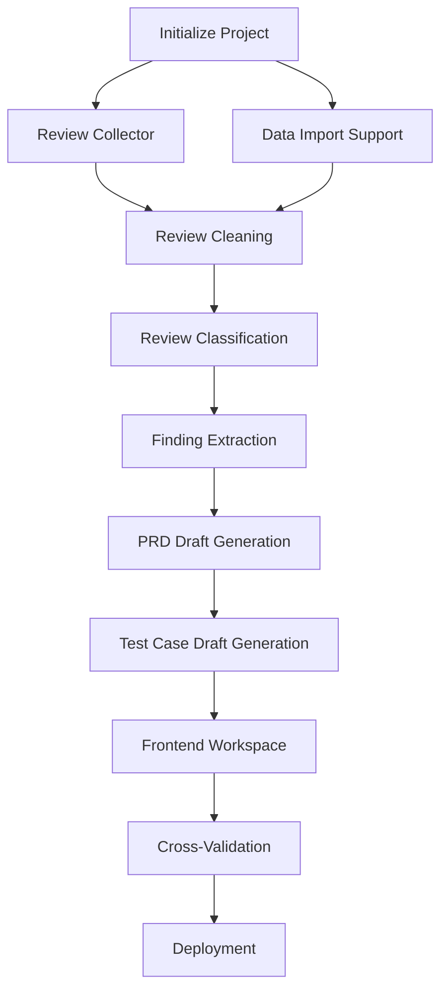

# TASKS.md

# App Review Insights

> MVP Development Plan (48-Hour Sprint)

Version: **V1.0 (MVP)**

---

# 1. Development Strategy

This project follows a **48-hour MVP sprint**.

The primary objective is **not to build every possible feature**, but to deliver a complete AI workflow that transforms App Store reviews into structured product planning artifacts.

Development priorities:

1. Complete the end-to-end workflow.
2. Generate every required artifact.
3. Display every artifact in the UI.
4. Improve user experience only after the workflow is complete.

---

# 2. Sprint Overview

| Sprint | Goal | Artifact Produced |
|----------|------|------------------|
| Sprint 1 | Project Setup & Review Collection | Raw Reviews |
| Sprint 2 | Review Processing & Analysis | Cleaned Data, Classification Results, Findings |
| Sprint 3 | Product Planning | PRD Draft, Test Case Drafts |
| Sprint 4 | Frontend & Deployment | Complete AI Workspace |

---

# Sprint 1 — Project Initialization

## Goal

Build the project foundation and successfully retrieve App Store reviews.

---

## Task 1.1 — Initialize Project

Estimated Time

30 minutes

Objectives

- Initialize Git repository
- Create frontend project
- Create backend project
- Configure environment variables

Deliverables

- Next.js
- FastAPI
- Project structure

Commit

```text
feat: initialize project
```

---

## Task 1.2 — Backend Skeleton

Estimated Time

30 minutes

Objectives

Create backend modules.

```text
backend/

api/

collector/

analyzer/

planner/

prompts/

schemas/

services/
```

Commit

```text
feat: create backend architecture
```

---

## Task 1.3 — Apple Review Collector

Estimated Time

2 hours

Objectives

- Parse Apple App Store URL
- Extract App ID
- Retrieve reviews
- Preserve review metadata

Artifact Produced

✅ Raw Reviews

Acceptance Criteria

Input

```text
Apple App URL
```

Output

```json
{
    "raw_reviews":[]
}
```

Commit

```text
feat: implement Apple review collector
```

---

## Task 1.4 — Raw Review Viewer

Estimated Time

1 hour

Objectives

Display:

- Rating
- Date
- Review Content

Commit

```text
feat: display raw reviews
```

---

# Sprint 1 Milestone

Users can:

- Paste an Apple App Store URL
- Retrieve reviews
- View Raw Reviews

---

# Sprint 2 — Review Processing

## Goal

Transform raw reviews into structured insights.

---

## Task 2.1 — Review Cleaning

Estimated Time

30 minutes

Objectives

- Remove duplicate reviews
- Normalize fields
- Standardize review format

Artifact Produced

✅ Cleaned Data

Commit

```text
feat: implement review cleaning
```

---

## Task 2.2 — Review Classification

Estimated Time

2 hours

Objectives

Classify reviews using an LLM.

⚠️ Categories MUST be discovered dynamically by the LLM based on the actual review content and the user's analysis goal. Do NOT hardcode a fixed category list.

Artifact Produced

✅ Classification Results

Commit

```text
feat: implement review classification
```

---

## Task 2.3 — Finding Extraction

Estimated Time

1 hour

Objectives

Generate evidence-backed findings.

Each finding includes:

- Summary
- Supporting Reviews
- Confidence Score

Artifact Produced

✅ Findings

Commit

```text
feat: implement finding extraction
```

---

## Task 2.4 — Analysis Workspace

Estimated Time

1 hour

Display:

- Cleaned Data
- Classification Results
- Findings

Commit

```text
feat: display analysis artifacts
```

---

# Sprint 2 Milestone

Users can inspect:

- Raw Reviews
- Cleaned Data
- Classification Results
- Findings

---

# Sprint 3 — Product Planning

## Goal

Generate structured product planning artifacts.

---

## Task 3.1 — PRD Draft Generation

Estimated Time

2 hours

Objectives

Generate a structured PRD Draft containing:

- Background
- Problem Statement
- Supporting Findings
- User Stories
- Functional Requirements
- Acceptance Criteria
- Priority
- Target Version (grouping requirements into releases: v1.1 / v1.2 / v2.0)
- Assumption flags (marking requirements based on inferred rather than direct evidence)

Artifact Produced

✅ PRD Draft

Commit

```text
feat: generate PRD draft
```

---

## Task 3.2 — Test Case Draft Generation

Estimated Time

1 hour

Objectives

Generate QA Test Case Drafts from the PRD Draft.

Each test case references the related functional requirement.

Artifact Produced

✅ Test Case Drafts

Commit

```text
feat: generate test case drafts
```

---

## Task 3.3 — Traceability

Estimated Time

1 hour

Objectives

Build artifact relationships.

```text
Raw Reviews
      │
      ▼
Cleaned Data
      │
      ▼
Classification Results
      │
      ▼
Findings
      │
      ▼
PRD Draft
      │
      ▼
Test Case Drafts
```

Commit

```text
feat: implement artifact traceability
```

---

## Task 3.4 — Data Import Support

Estimated Time

1 hour

Objectives

Support importing review data from JSON and CSV files.

Accept these formats:

JSON: `{"reviews": [{...}]}` or `[{...}]` array
CSV: `id,rating,title,content,author,date` headers

When `import_data` is provided, skip the collect stage entirely.

Commit

```text
feat: support JSON and CSV data import
```

---

## Task 3.5 — Planning Workspace

Estimated Time

1 hour

Display:

- PRD Draft
- Test Case Drafts

Commit

```text
feat: display planning artifacts
```

---

# Sprint 3 Milestone

Users can inspect:

- PRD Draft
- Test Case Drafts
- Artifact Traceability

---

# Sprint 4 — Frontend & Deployment

## Goal

Complete the AI Workspace and prepare the interview demo.

---

## Task 4.1 — Cross-Validation with Second App

Estimated Time

30 minutes

Objectives

- Run the full pipeline on a completely different app (e.g., a productivity or social media app)
- Verify no app-specific logic crashes or produces nonsensical results
- Verify categories are dynamically discovered (not leaking from the workout app)
- Fix any issues found

Deliverables

- Verified generalization

Commit

```text
test: validate with second app
```

---

## Task 4.2 — Workflow Progress

Estimated Time

1 hour

Display workflow stages.

```text
✓ Collect Reviews

✓ Clean Reviews

✓ Classify Reviews

✓ Extract Findings

✓ Generate PRD Draft

✓ Generate Test Case Drafts
```

Commit

```text
feat: add workflow progress
```

---

## Task 4.3 — Workspace Polish

Estimated Time

1 hour

Improve:

- Loading state
- Empty state
- Error state
- Layout consistency

Commit

```text
style: polish workspace
```

---

## Task 4.4 — Deployment

Estimated Time

1 hour

Deploy:

- Frontend
- Backend

Commit

```text
chore: deploy MVP
```

---

## Task 4.5 — Documentation

Estimated Time

1 hour

Complete:

- README
- PROJECT_SPEC
- ARCHITECTURE
- TASKS
- PROMPTS
- DECISIONS
- AI_STRATEGY

Commit

```text
docs: finalize documentation
```

---

# Sprint 4 Milestone

The application is interview-ready.

---

# 3. Artifact Pipeline

The completed workflow should produce the following artifacts.

```text
Raw Reviews
      │
      ▼
Cleaned Data
      │
      ▼
Classification Results
      │
      ▼
Findings
      │
      ▼
PRD Draft
      │
      ▼
Test Case Drafts
```

Each artifact should be visible in the frontend.

---

# 4. MVP Checklist

## Backend

- [ ] Apple Review Collector
- [ ] Review Cleaning
- [ ] Review Classification
- [ ] Finding Extraction
- [ ] PRD Draft Generation
- [ ] Test Case Draft Generation
- [ ] Traceability

---

## Frontend

- [ ] URL Input
- [ ] File Import (JSON / CSV)
- [ ] Workflow Progress
- [ ] Raw Reviews
- [ ] Cleaned Data
- [ ] Classification Results
- [ ] Findings
- [ ] PRD Draft
- [ ] Test Case Drafts
- [ ] Traceability View

---

## Deployment

- [ ] Frontend Online
- [ ] Backend Online
- [ ] Documentation Complete

---

# 5. Task Dependency Graph



---

# 6. V2 Enhancements

Begin only after the MVP is complete.

Possible enhancements:

- Google Play Reviews
- Streaming Workflow
- Markdown / PDF Export
- Prompt Versioning
- Retry Mechanism
- Historical Trend Analysis
- Better Error Recovery

---

# 7. V3 Future Vision

Potential future evolution:

- Multi-Agent Workflow
- LangGraph Orchestration
- Embedding Retrieval
- Competitor Analysis
- Autonomous Product Planning
- Jira / Notion Integration

These features are intentionally excluded from the interview MVP.

---

# Definition of Done

The MVP is complete when a user can:

- Paste an Apple App Store URL.
- Run the workflow.
- View every intermediate artifact.
- View the generated PRD Draft.
- View the generated Test Case Drafts.
- Understand traceability across the workflow.

---

# End of Document